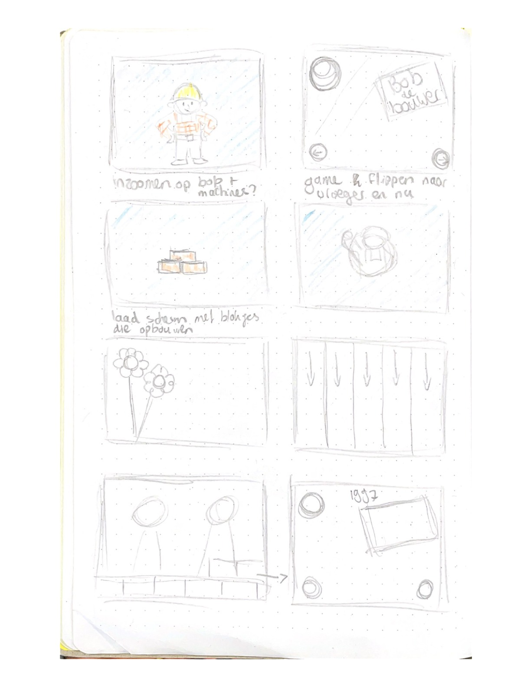
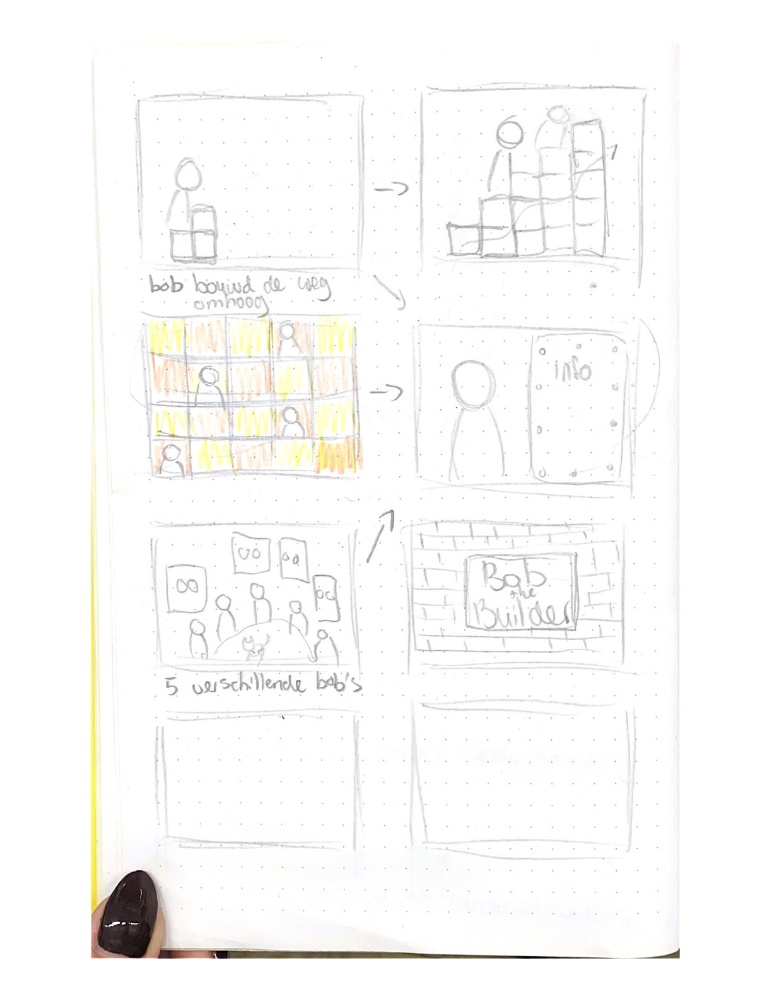
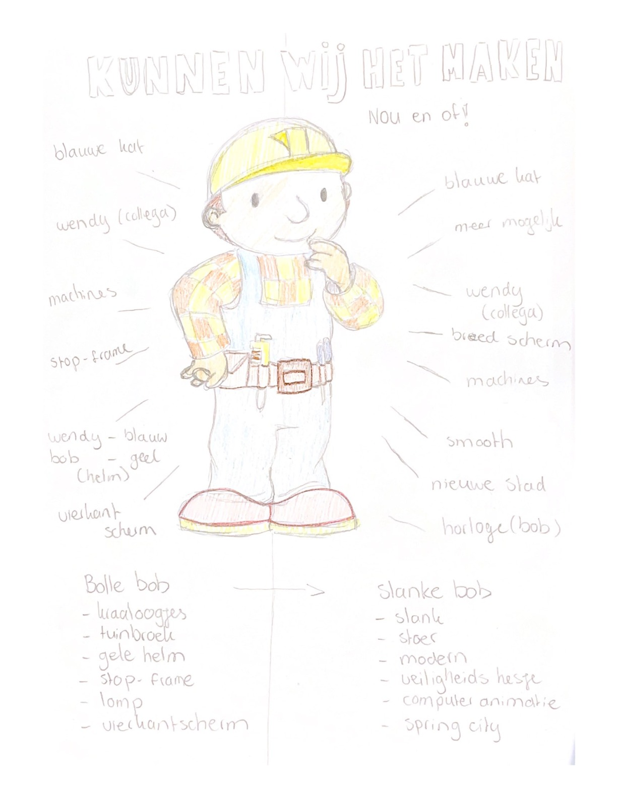
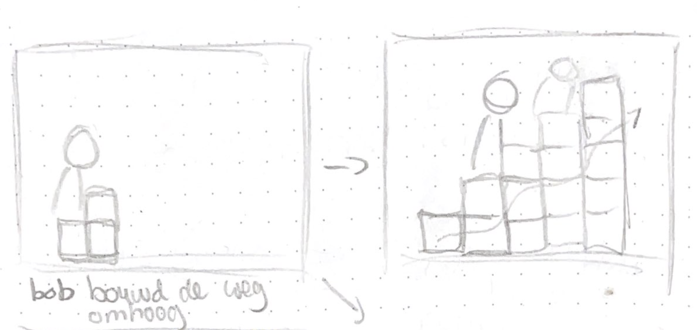
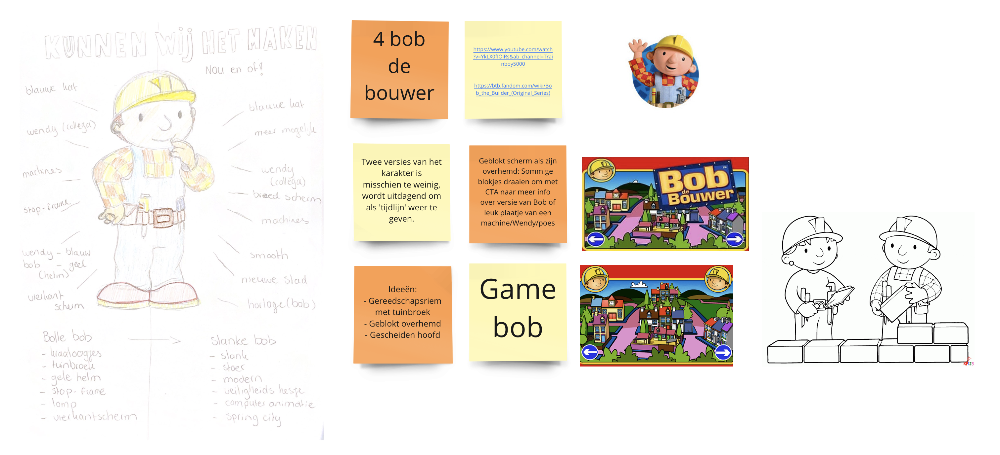
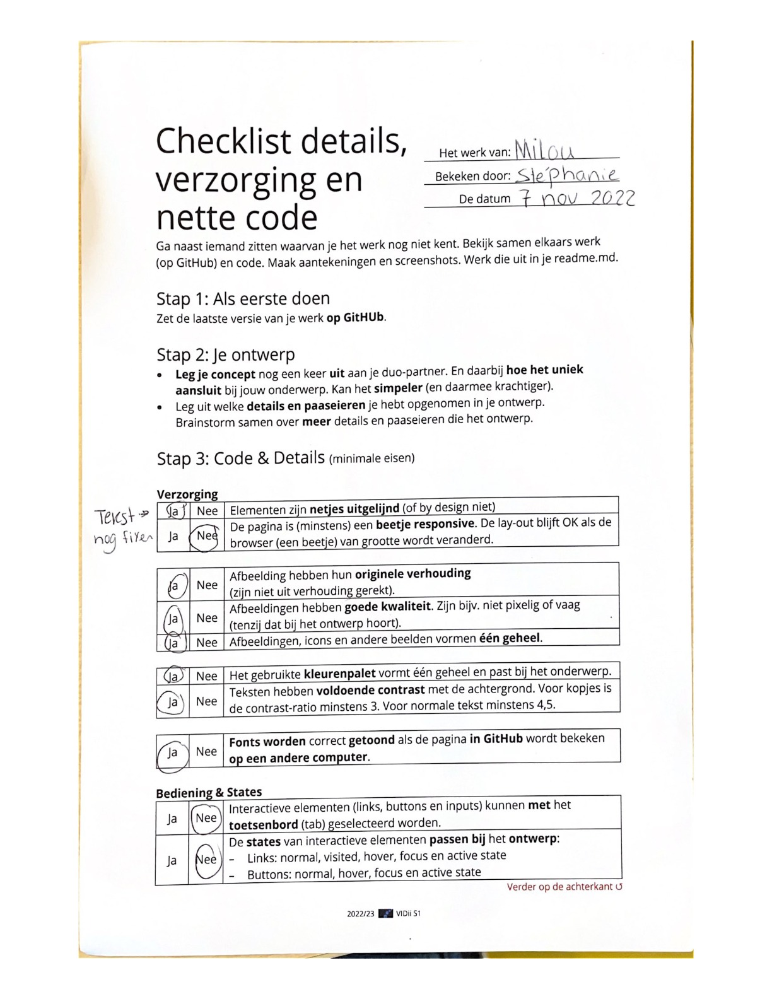
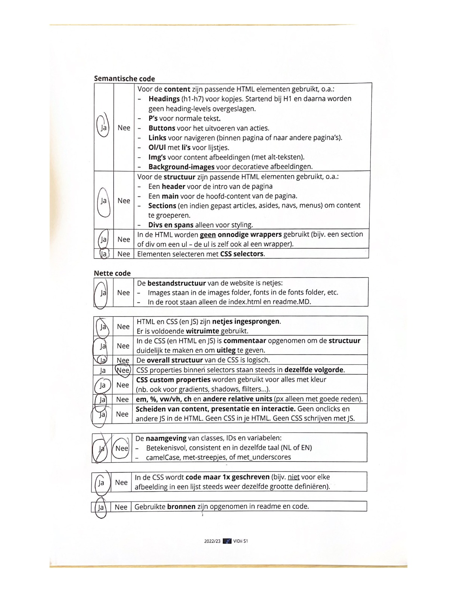
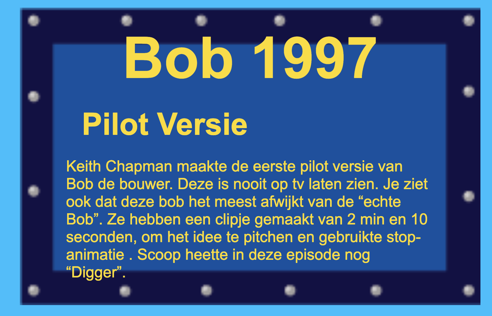

# Procesverslag
Markdown is een simpele manier om HTML te schrijven.  
Markdown cheat cheet: [Hulp bij het schrijven van Markdown](https://github.com/adam-p/markdown-here/wiki/Markdown-Cheatsheet).

Nb. De standaardstructuur en de spartaanse opmaak van de README.md zijn helemaal prima. Het gaat om de inhoud van je procesverslag. Besteedt de tijd voor pracht en praal aan je website.

Nb. Door *open* toe te voegen aan een *details* element kun je deze standaard open zetten. Fijn om dat steeds voor de relevante stuk(ken) te doen.

## Jij

### Ontwerper:
Milou Mulder

#### Je startniveau:
Mijn startniveau is: blauw

# Je plan

  
De eerste versie/schets van je ontwerp & je persoonlijke uitdaging

  ### De eerste schetsen:
  
  
  

  ### Mijn eerste idee :

  

  ### Je ambitie: 
  Aan deze technieken/punten wil ik werken:
  - punt 1: Nieuwe code leren kennen, maakt niet uit wat
  - punt 2: Beter worden in animeren (css)
  - Punt 3: Beter worden in het positioneren van items 
  - Punt 4: Beter worden in schaduws toevoegen 
  - Punt 5: Beter worden in een beetje responsive maken 
 

## Voortgang/Feedback 1

  
Mijn bevindingen + wijzigingen (minimaal 5)

  ### Bevinding 1:
  Mijn idee had ik nog niet helemaal duidelijk voor mezelf. Daarom zijn we samen een beetje gaan brainstormen over het idee. 
  We kwamen er achter dat Bob de Bouwer niet heel veel veranderingen heeft gemaakt door de jaren heen. 
  Ik kom uit op 3 of 4 Bob's. Hieronder zie je mijn miro bord, met extra ideetjes. 

  

  #### oplossing:
  Na een tijdje zoeken hebben we dus 4 Bobjes gevonden en ga ik mezelf als Bob toevoegen (als paasei). Dan heb ik meer bobjes. 

  ### Bevinding 2:
  Ook kon ik weinig info vinden over Bob de Bouwer. Daarom zijn we samen gaan zoeken om meer informatie te vinden. 
  We hebben een aantal sites gevonden en die linkjes hebben we in het miro bord gezet.

  #### oplossing:
  Door de linkjes in het miro bord heb ik meer informatie kunnen vinden, waardoor ik meer ideëen kreeg voor het ontwerp. Ook 
  heb ik nu wat meer informatie om te vertellen over de Bobjes. 

  ### Bevinding 3:
  Door meer afbeeldingen te zoeken, heb ik meer inspiratie gekregen. Ik had twee ideetjes in mijn hoofd. Het eerste idee was om alle Bobjes 
  bij elkaar te zetten en een leuke achtergrond toe te voegen. Het tweede idee was om Bob steeds omhoog te laten bouwen met bakstenen. 

  #### oplossing:
  Uiteindelijk heb ik ervoor gekozen om het tweede idee uit te werken. Dit idee is wel het moeilijkste idee om uit te werken, maar ik ga het gewoon 
  proberen. Het eerste idee had ook 2 schermen nodig en dat mag niet. Ik moet nog wel bedenken hoe ik de informatie laat zien.

  ### Bevinding 4:
  Als ik idee 1 zou uitwerken, zou je meteen zien dat het over Bob de Bouwer gaat. Bij idee is dat wel iets lastiger en zou ik dingen moeten toevoegen.

  #### oplossing:
  Ik ga de achtergrond lichtblauw maken of misschien nog afbeeldingen toevoegen. Ik ga kijken of dat kan, want misschien wordt het te druk. 

  ### Bevinding 5:
  Als ik vormen ga gebruiken in mijn ontwerp, zouden vierkante vormen beter passen bij Bob de Bouwer. 

  #### oplossing:
  Ik ga dus de blokjes (bakstenen) vierkant maken. Verder heb ik nog geen andere vormen gebruikt in mijn ontwerp.

## Voortgang/Feedback 2

  
Mijn bevindingen + wijzigingen (minimaal 5)

   ### Feedbackformulier:

  
  
  
  ### Bevinding 1:
  Ik moet mijn site nog iets meer responsive maken. Als ik de site iets kleiner maak, dan loopt de tekst nog over mijn bord heen. 

  #### oplossing:
  Ik kan dan aanpassen door het bord iets groter te maken, of ik kan de tekst scrolbaar maken. Uiteindelijk heb ik ervoor gekozen om 
  het bord groter te maken, omdat de scrolbare tekst er niet mooi uit zag met het bord. 

  ### Bevinding 2:
  Ik moet er nog voor zorgen dat je door de site heen kan tabben. 

  #### oplossing:
  Door meer states toe te voegen, hoop ik dit op te lossen. Ik wil witte randjes om mijn buttons maken, zodat het duidelijk is. 

  ### Bevinding 3:
  Ik moet nog meer states toevoegen aan mijn ontwerp. Zo wordt het bijvoorbeeld duidelijker dat je kan klikken op mijn buttons. 

  #### oplossing:
  Ik wil deze states nog toevoegen aan mijn buttons:
  - hover 
  - focus-visible
  - active 

  ### Bevinding 4: 
  Ik moet de CSS properties nog op goede volgorde zetten.

  #### oplossing:
  Het is netter als ik de properties op de goede volgorde zet, dus dat ga ik nog doen.  

  ### Bevinding 5:
  Mijn laatste Bobje valt over de tekst heen. Zie foto hieronder.

  

  #### oplossing:
  Ik ga of de tekst weghalen of de blokjes naar beneden verplaatsen.

  ### Bevinding 6:
  De tekstopmaak moet ik ook nog iets aanpassen, want dat staat nu nog niet helemaal lekker. Zie voorbeeld hieronder:

  

  #### oplossing:
  Ik zal nog een keer kijken naar de tekst en ook het lettertype daarbij. 
  

  ### Wat ik zelf nog wil aanpassen:
 
  - Tekst goed zetten + responsive
  - Titels opmaken + rode rand geven
  - Bloemen toevoegen en een kat 
  - Kat laten miauwen  
  - Dark mode toevoegen
  - Bronnen in de code zetten 
  - Cursor toevoegen (misschien een hamertje)
  - Bord naar beneden laten bounchen

## Voortgang/Feedback 3

  
Mijn bevindingen + wijzigingen (minimaal 5)

  
  ### Bevinding 1:
  

  #### oplossing:
  

  ### Bevinding 2:
  

  #### oplossing:
  

  ### Bevinding 3:

  #### oplossing:

  ### Bevinding 2:
  

  #### oplossing:

  ### Bevinding 2:
  

  #### oplossing:
  

## Reflectie

  
Mijn eindresultaat & persoonlijke ontwikkeling

  ### Je uitkomst - karakteristiek screenshot(s):
  

  ### Dit ging goed/Heb ik geleerd: 
  Korte omschrijving met plaatje(s)

  

  ### Dit was lastig/Is niet gelukt:
  Korte omschrijving met plaatje(s)

  

## Bronnenlijst

continu bijhouden terwijl je werkt

1. Afbeelding Bob de bouwer 1997 
https://www.youtube.com/watch?v=QSoH9aTrA-g 
2. Afbeelding Bob de Bouwer 1998
https://btb.fandom.com/wiki/Bob_the_Builder_(Original_Series)?file=Bob%2527s_1st_Prototype_Design_by_Curtis_Jobling_%2528Late_1997-Early_1998%2529%257E2.jpg
3. Afbeelding Bob de Bouwer 1999 
http://www.eslevents.nl/kinderactiviteit/meet%20and%20greet/Meet%20and%20greet%20met%20bob%20de%20bouwer.htm
4. Afbeelding Bob de Bouwer nu 
https://easybookings.nl/artiest/bob-de-bouwer/
5. Bloemetjes bdb (gebruikt om over te tekenen)
https://www.npo3.nl/bob-de-bouwer/POW_00325265
6. Info Bob de Bouwer 1997 pilot versie
https://btb.fandom.com/wiki/Pilot_Episode
7. Info Bob de Bouwer 1998 
https://btb.fandom.com/wiki/Bob_the_Builder_(Original_Series)?file=Bob%2527s_1st_Prototype_Design_by_Curtis_Jobling_%2528Late_1997-Early_1998%2529%257E2.jpg
8. Info Bob de Bouwer 1999
https://www.youtube.com/watch?v=RQBhafPQLPY
9. Info Bob de Bouwer Nu
https://www.ad.nl/buitenland/bob-de-bouwer-wordt-zelf-verbouwd-fans-verbijsterd~ae87c2e0/
10. Bob de Bouwer tekening
https://www.pintarcolorir.com/nl/desenhos/bob-o-construtor/pintar-colorir-bob-o-construtor-080
11. Bob de Bouwer pak 
https://www.fruugo.nl/orion-costumes-mens-bob-the-builder-kids-tv-cartoon-character-fancy-dress/p-35081352-96559243?language=en&ac=croud&gclid=CjwKCAiA9qKbBhAzEiwAS4yeDTeCd0zV8v8kGBjo-QACCIPyeJ6VoItPKMlMUCRRPTHW6tPCvRzFRBoCMpEQAvD_BwE
12. Bob de Bouwer helm
https://www.incognito-kledingverhuur.nl/bob-de-bouwer-kostuum-huren.html

