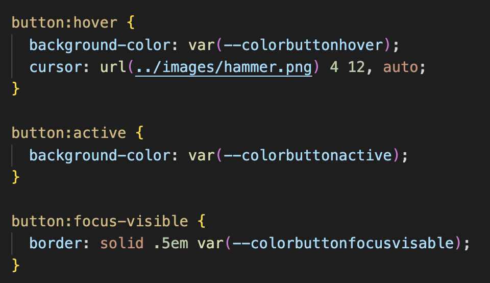
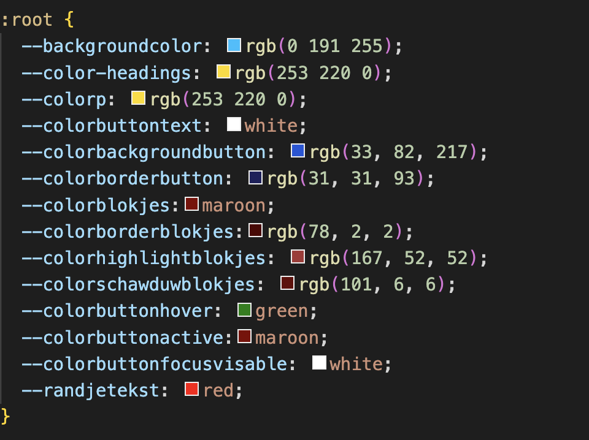
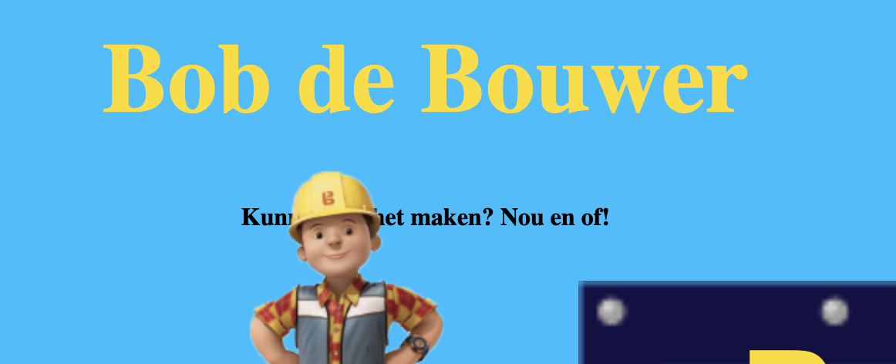
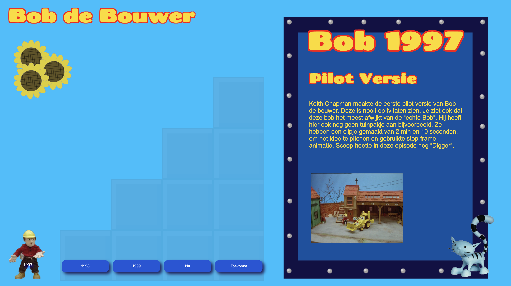
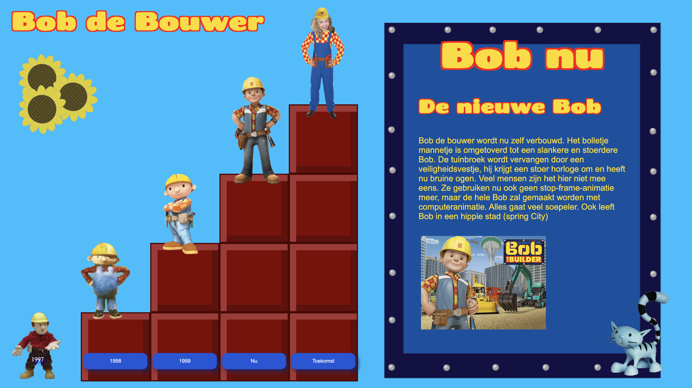
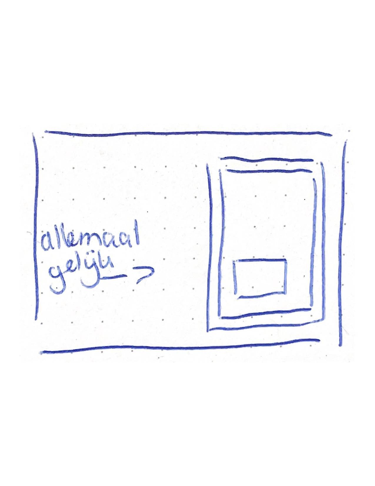
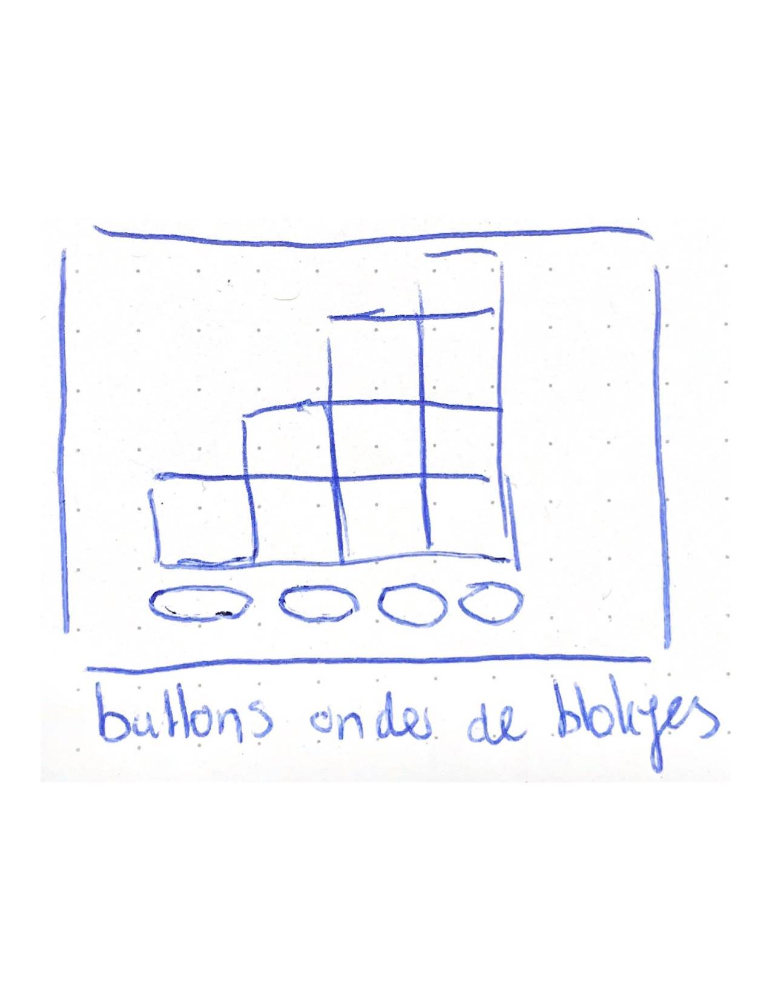
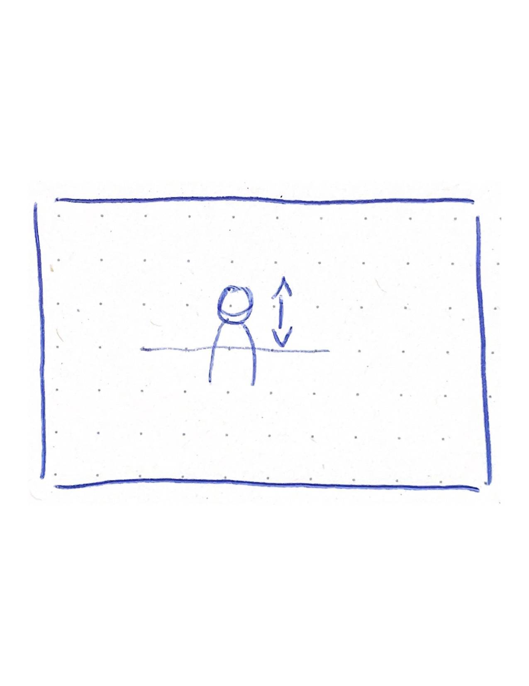

# Procesverslag
Markdown is een simpele manier om HTML te schrijven.  
Markdown cheat cheet: [Hulp bij het schrijven van Markdown](https://github.com/adam-p/markdown-here/wiki/Markdown-Cheatsheet).

Nb. De standaardstructuur en de spartaanse opmaak van de README.md zijn helemaal prima. Het gaat om de inhoud van je procesverslag. Besteedt de tijd voor pracht en praal aan je website.

Nb. Door *open* toe te voegen aan een *details* element kun je deze standaard open zetten. Fijn om dat steeds voor de relevante stuk(ken) te doen.

## Jij

### Ontwerper:
Milou Mulder

#### Je startniveau:
Mijn startniveau is: blauw

# Je plan

  
De eerste versie/schets van je ontwerp & je persoonlijke uitdaging

  ### De eerste schetsen:
  
  
  

  ### Mijn eerste idee :
  

  ### Je ambitie: 
  Aan deze technieken/punten wil ik werken:
  - punt 1: Nieuwe code leren kennen, maakt niet uit wat
  - punt 2: Beter worden in animeren
  - Punt 3: Beter worden in het positioneren van items 
  - Punt 4: Beter worden in schaduws toevoegen 
  - Punt 5: Beter worden in een beetje responsive maken 
  - Punt 6: Iets nieuws leren in JS
 

## Voortgang/Feedback 1

  
Mijn bevindingen + wijzigingen (minimaal 5)

  ### Bevinding 1:
  Mijn idee had ik nog niet helemaal duidelijk voor mezelf. Daarom zijn we samen een beetje gaan brainstormen over het idee. 
  We kwamen er achter dat Bob de Bouwer niet heel veel veranderingen heeft gemaakt door de jaren heen. 
  Ik kom uit op 3 of 4 Bob's. Hieronder zie je mijn miro bord, met extra ideetjes. 

  

  #### oplossing:
  Na een tijdje zoeken hebben we dus 4 Bobjes gevonden en ga ik mezelf als Bob toevoegen (als paasei). Dan heb ik meer bobjes. 

  ### Bevinding 2:
  Ook kon ik weinig informatie vinden over Bob de Bouwer. Daarom zijn we samen gaan zoeken om meer informatie te vinden. 
  We hebben een aantal sites gevonden en die linkjes hebben we in het miro bord gezet.

  #### oplossing:
  Door de linkjes in het miro bord heb ik meer informatie kunnen vinden, waardoor ik meer ideëen kreeg voor het ontwerp. Ook 
  heb ik nu wat meer informatie om te vertellen over de Bobjes. Ik moet alleen nog bedenken, hoe ik die informatie ga laten zien.

  ### Bevinding 3:
  Door meer afbeeldingen te zoeken, heb ik meer inspiratie gekregen. Ik had twee ideetjes in mijn hoofd. Het eerste idee was om alle Bobjes 
  bij elkaar te zetten en een leuke achtergrond toe te voegen. Het tweede idee was om Bob steeds omhoog te laten bouwen met bakstenen. 

  #### oplossing:
  Uiteindelijk heb ik er toch voor gekozen om het tweede idee uit te werken (met de bakstenen). Dit idee is wel het moeilijkste idee om uit te werken, maar ik ga het gewoon proberen. Het eerste idee had ook 2 schermen nodig en dat mag niet. 

  ### Bevinding 4:
  Als ik idee 1 zou uitwerken, zou je meteen zien dat het over Bob de Bouwer gaat. Bij idee is dat wel iets lastiger en zou ik dingen moeten toevoegen.

  #### oplossing:
  Ik ga de achtergrond lichtblauw maken of misschien nog afbeeldingen toevoegen. Ik ga kijken of dat kan, want misschien wordt het te druk. 

  ### Bevinding 5:
  Als ik vormen ga gebruiken in mijn ontwerp, zouden vierkante vormen beter passen bij Bob de Bouwer. 

  #### oplossing:
  Ik ga dus de blokjes (bakstenen) vierkant maken. Verder heb ik nog geen andere vormen gebruikt in mijn ontwerp. Ik ga goed kijken naar oude afbeeldingen/filmpjes voor inspiratie.

## Voortgang/Feedback 2

  
Mijn bevindingen + wijzigingen (minimaal 5)

   ### Feedbackformulier:

  
  
  
  ### Bevinding 1:
  Ik moet mijn site nog iets meer responsive maken. Als ik de site iets kleiner maak, dan loopt de tekst nog over mijn bord heen. 

  #### oplossing:
  Ik kan dat aanpassen door het bord iets groter te maken, of ik kan de tekst scrolbaar maken. Uiteindelijk heb ik ervoor gekozen om 
  het bord groter te maken, omdat de scrolbare tekst er niet mooi uit zag met het bord dat ik heb gemaakt. 

  ### Bevinding 2:
  Ik moet er nog voor zorgen dat je door de site heen kan tabben. Daar was ik nog niet aan toe gekomen. 

  #### oplossing:
  Door meer states toe te voegen, hoop ik dit op te lossen. Ik wil witte randjes om mijn buttons maken, zodat het duidelijk is. Ik houd het simpel. 

  ### Bevinding 3:
  Ik moet nog meer states toevoegen aan mijn ontwerp. Zo wordt het bijvoorbeeld duidelijker dat je kan klikken op mijn buttons. 

  #### oplossing:
  Ik wil deze states nog toevoegen aan mijn buttons:
  - hover 
  - focus-visible
  - active 

  

  ### Bevinding 4: 
  Ik moet de CSS properties nog aanvullen. Ik heb deze nog niet op alle plekken toegepast.

  #### oplossing:
  Dit zal ik dus nog controleren en verbeteren. 

  

  ### Bevinding 5:
  Mijn laatste Bobje valt over de tekst heen. Zie foto hieronder. Aan de ene kant vind ik het ook wel weer een speels effect. Dat past wel bij Bob de Bouwer.

  

  #### oplossing:
  Ik ga of de tekst weghalen of de blokjes naar beneden verplaatsen.

  ### Bevinding 6:
  De tekstopmaak moet ik ook nog iets aanpassen, want dat staat nu nog niet helemaal lekker. Zie voorbeeld hieronder:

  

  #### oplossing:
  Ik zal nog een keer kijken naar de positie van de tekst en ik ga toch naar een ander lettertype kijken, want ik vind dit lettertype nog niet helemaal aansluiten bij Bob de Bouwer.  
  

  ### Wat ik zelf nog wil aanpassen:
 
  - Tekst goed zetten + responsive
  - Titels opmaken + rode rand geven
  - Bloemen toevoegen en een kat 
  - Kat laten miauwen  
  - Dark mode toevoegen
  - Bronnen in de code zetten 
  - Cursor toevoegen (misschien een hamertje)
  - Bord naar beneden laten bounchen

## Voortgang/Feedback 3

  
Mijn bevindingen + wijzigingen (minimaal 5)

  
  ### Bevinding 1:
  Code is netjes en goed leesbaar. De comments kunnen wel iets groter, zodat ze sneller te zien zijn tussen je code.

  #### oplossing:
  Ik zal de belangrijkste comments groter maken in mijn CSS en JS. Ik vond dit een goeie tip, omdat ik het zelf ook al lastig te lezen vond.

  ### Bevinding 2:
  Elke Bob heeft een foto in het bord staan, behalve bij je eigen Bob. Ook als Stela mijn site opent in GitHub, was mijn eigen Bob niet te zien op de steentjes. 

  #### oplossing:
  Ik zal nog een foto van mezelf toevoegen toen ik klein was en ga kijken wat er mis is met mijn afbeelding. Ook zal ik mijn GitHub nog eens laten checken door iemand.

  ### Bevinding 3:
  De eerste Bob is een beetje verstopt, omdat hij niet op een blokje staat. 

  #### oplossing:
  Ik zou een klein stukje van een blokje toe kunnen voegen, zodat hij iets meer opvalt.Dit ga ik alleen niet meer doen. 

  ### Bevinding 4:
  Het plaatje gaat iets over de tekst heen als je het scherm iets kleiner maakt. Verder is de site voldoende responsive.

  #### oplossing:
  Ik ga het plaatje kleiner maken of iets in de css aanpassen zodat hij wel responsive is. Waarschijnlijk heb ik de plaatjes op position absolute staan.

  ### Bevinding 5:
  De eerste Bob heeft geen knop en de rest wel. Misschien kan je die nog toevoegen. 

  #### oplossing:
  Ik zou nog een knop kunnen toevoegen, maar dat ga ik niet meer doen.

  ### Bevinding 6:
  Je kan de knop een kleur geven als hij al een keer ingedrukt is geweest. Zo weet je dat je die al bekeken hebt. 

  #### oplossing:
  Ik kan nog een state toevoegen aan mijn buttons. Ik ga kijken of ik daar nog tijd voor heb. Dat zou dan met JS moeten omdat het geen link is (visited).

  ### Extra:
  Leuk concept, 5e Bob is heel uniek en dat hamer geluid is erg grappig. 

## Reflectie

  
Mijn eindresultaat & persoonlijke ontwikkeling

  ### Je uitkomst - karakteristiek screenshot(s):

  

  

  ### Dit ging goed/Heb ik geleerd: 

  Ik heb tijdens dit vak veel geleerd. Onder andere:

  - Positioneren van plaatjes en tekst
  - Met JavaScript plaatjes en tekst laten veranderen 
  - Met CSS/JavaScript de blokjes 1 voor 1 laten opkomen :)
  - Plaatjes op en neer laten bewegen 
  - Cursor laten veranderen in een plaatje 
  - Schaduws toegevoegd (binnen en buiten) aan de blokjes 
  - Leren werken met een grid
  - Verschillende states toevoegen aan buttons 

  Waar ik het meest trots op ben zijn de blokjes die 1 voor 1 opkomen en de plaatjes/tekst die verwisseld wordt in JS.

  ### Dit was lastig/Is niet gelukt:

  Ik ben blij dat ik voor mijn tweede idee heb gekozen, ookal vond ik het wel lastig. Ik heb hier veel meer van geleerd. Ook zijn er nog een aantal dingen niet gelukt die ik eigenlijk wel had willen doen zoals:

  - Het bord uit de bovenkant van het scherm laten animeren wanneer je klikt op een button.

   

  - De plaatjes in het bord een andere opmaak geven (los van elkaar)

   

  - De buttons onder de blokjes laten staan en de blokjes zelf kleiner maken, zodat je niet hoeft te scrollen.

    

  - De laatste 2 Bobjes springen nu iets lager dan de rest. Dat had ik hetzelfde willen maken.

  

  - Knop toevoegen aan het eerste Bobje 
  - Nog een blokje toevoegen, zodat Bob 1 ook op een blokje staat en dus beter opvalt.

## Bronnenlijst

continu bijhouden terwijl je werkt

## sorry deze plaatjes/tekst heb ik gestolen :)

1. Afbeelding Bob de bouwer 1997 
https://www.youtube.com/watch?v=QSoH9aTrA-g 
2. Afbeelding Bob de Bouwer 1998
https://btb.fandom.com/wiki/Bob_the_Builder_(Original_Series)?file=Bob%2527s_1st_Prototype_Design_by_Curtis_Jobling_%2528Late_1997-Early_1998%2529%257E2.jpg
3. Afbeelding Bob de Bouwer 1999 
http://www.eslevents.nl/kinderactiviteit/meet%20and%20greet/Meet%20and%20greet%20met%20bob%20de%20bouwer.htm
4. Afbeelding Bob de Bouwer nu 
https://easybookings.nl/artiest/bob-de-bouwer/
5. Bloemetjes bdb (gebruikt om over te tekenen)
https://www.npo3.nl/bob-de-bouwer/POW_00325265
6. Info Bob de Bouwer 1997 pilot versie
https://btb.fandom.com/wiki/Pilot_Episode
7. Info Bob de Bouwer 1998 
https://btb.fandom.com/wiki/Bob_the_Builder_(Original_Series)?file=Bob%2527s_1st_Prototype_Design_by_Curtis_Jobling_%2528Late_1997-Early_1998%2529%257E2.jpg
8. Info Bob de Bouwer 1999
https://www.youtube.com/watch?v=RQBhafPQLPY
9. Info Bob de Bouwer Nu
https://www.ad.nl/buitenland/bob-de-bouwer-wordt-zelf-verbouwd-fans-verbijsterd~ae87c2e0/
10. Bob de Bouwer tekening
https://www.pintarcolorir.com/nl/desenhos/bob-o-construtor/pintar-colorir-bob-o-construtor-080
11. Bob de Bouwer pak 
https://www.fruugo.nl/orion-costumes-mens-bob-the-builder-kids-tv-cartoon-character-fancy-dress/p-35081352-96559243?language=en&ac=croud&gclid=CjwKCAiA9qKbBhAzEiwAS4yeDTeCd0zV8v8kGBjo-QACCIPyeJ6VoItPKMlMUCRRPTHW6tPCvRzFRBoCMpEQAvD_BwE
12. Bob de Bouwer helm
https://www.incognito-kledingverhuur.nl/bob-de-bouwer-kostuum-huren.html
13. Bob de Bouwer plaatje bord 1
https://btb.fandom.com/wiki/Pilot_Episode?file=PilotEpisode8.png
14. Bob de Bouwer plaatje bord 2
https://btb.fandom.com/wiki/Bob_the_Builder_(Original_Series)?file=Bob%2527s_Early_1998_Design_by_Curtis_Jobling.jpg
15. Bob de Bouwer plaatje bord 3 
https://www.moviemeter.nl/series//series/show/863
16. Bob de Bouwer plaatje bord 4
https://www.primevideo.com/detail/Bob-De-Bouwer/0QKCMAMAO86TT72DRCGUQXX5M5?_encoding=UTF8&language=nl_NL

